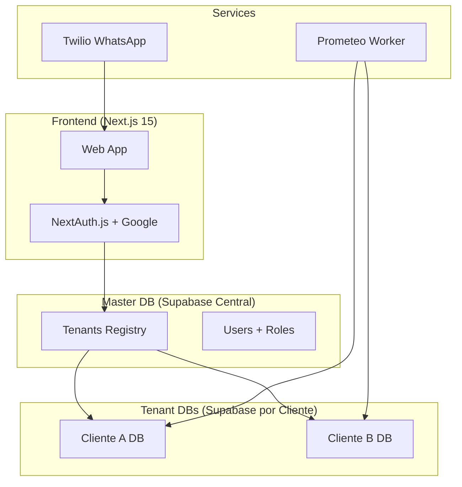

# Tuqui Agents Alpha - Plan de Implementación

Plataforma multi-tenant de agentes IA con autenticación Google, bases de datos aisladas por cliente, agentes out-of-the-box y custom, notificaciones programadas (Prometeo), y exposición por WhatsApp vía Twilio.

## 1. Arquitectura General

---

## 2. Stack Tecnológico

| Componente | Tecnología |
|------------|------------|
| Framework | Next.js 15 (App Router) |
| Auth | NextAuth.js v5 + Google Provider |
| AI | Vercel AI SDK + Gemini 2.5 Flash |
| Master DB | Supabase (tenant registry + auth) |
| Tenant DBs | Supabase (una instancia por cliente) |
| Embeddings | Gemini text-embedding-004 |
| Vector Search | pgvector |
| Push Notifications | Web Push API + Service Workers |
| WhatsApp | Twilio Programmable Messaging |
| Deploy | Vercel + Railway (worker) |

---

## 3. Guía de Archivos Clave

### Auth & Tenant Isolation
*   `lib/auth/config.ts`: Configuración de NextAuth. Inyecta el tenant en la sesión.
*   `middleware.ts`: Protege rutas y verifica sesión.
*   `lib/supabase/master.ts`: Cliente para la DB Master (routing de tenants).
*   `lib/supabase/tenant.ts`: Factory que crea clientes Supabase dinámicos para cada Tenant.

### Agents & AI
*   `lib/agents/registry.ts`: Definición de agentes "built-in" (hardcoded templates).
*   `lib/agents/service.ts`: Lógica para fusionar agentes built-in con los de la DB del tenant.
*   `app/api/chat/route.ts`: Endpoint principal. Maneja Auth, Billing Check, RAG Context, Tool Execution y Streaming de respuesta.

### Tools
*   `lib/tools/executor.ts`: Centraliza la carga y ejecución de tools (Odoo, MercadoLibre, etc) según config del agente.
*   `lib/tools/odoo/client.ts`: Cliente JSON-RPC para Odoo.
*   `lib/tools/mercadolibre/`: Tools de scraping para análisis de precios.

### RAG
*   `lib/rag/embeddings.ts`: Genera embeddings con Gemini.
*   `lib/rag/search.ts`: Busca vectores similares en `document_chunks` usando pgvector.

### Billing
*   `lib/billing/limits.ts`: Definición de planes y límites.
*   `lib/billing/tracker.ts`: Funciones para contar tokens y hacer enforce de límites.

### Integrations
*   `lib/prometeo/runner.ts`: Motor de tareas programadas (portable, agnóstico de plataforma).
*   `app/api/whatsapp/webhook/route.ts`: Webhook que recibe mensajes de Twilio e identifica al tenant por el número de destino.

---

## 4. Setup de Base de Datos

### Master DB Schema
Ubicación: `supabase/master-schema.sql`
*   `tenants`: Registro de clientes y sus credenciales de conexión.
*   `users`: Mapeo de emails a tenants y roles.

### Tenant DB Schema
Ubicación: `supabase/tenant-schema.sql`
*   Correr en **CADA** instancia de Supabase de cliente.
*   Contiene: `agents`, `chat_sessions`, `integrations`, `documents` (vector), `prometeo_tasks`.

---

## 5. Próximos Pasos (Roadmap Beta)
- [ ] Implementar UI para subir documentos RAG (Admin Dashboard).
- [ ] Implementar UI para conectar Odoo/MercadoLibre (guardar credenciales encriptadas).
- [ ] Integrar Stripe real para pagos de suscripción.
- [ ] Deploy de Prometeo via Vercel Cron.
